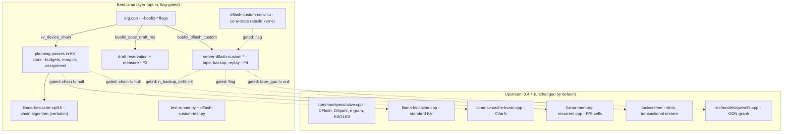
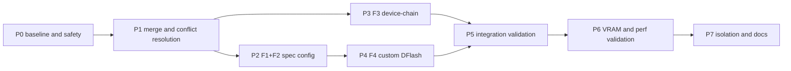

# BeeLlama 0.4.4 Preview Migration Plan (Task 6M)

Status: **PLAN — no source modified.** This document is the executable migration
plan for carrying the local fork (Y) forward onto BeeLlama 0.4.4 Preview (Z),
preserving the local BeeLlama layer as an additive, opt-in, flag-gated extension.

Companion documents (read before executing the relevant phases):

- [ref-s1-kv-device-chain.md](ref-s1-kv-device-chain.md) — full 0.4.4 KV
  constructor/call-site/budget inventory for the device-chain (F3).
- [ref-s2-custom-dflash.md](ref-s2-custom-dflash.md) — custom DFlash (F4)
  component map, Z anchor map, merge surface, and the one semantic conflict.
- `plans\migration-analysis\` — the prior architectural investigation
  (feature inventory F1–F7, option analyses, X/Y/Z archaeology).

## Source states

| Tag | Commit | Meaning |
|---|---|---|
| X / base | `ca155ad078c5d42cd2e350c3a6409d05f4e3da43` | 0.4.1 Preview (original fork point, Anbeeld) |
| base' | `176c1a16a54f955e5a803b948c746e0a4f58b447` | 0.4.1 actual — the **true 3-way merge base** (verified by `git merge-base` in both repos) |
| Y | `75ebe54544c15d0dbd7b3a15884c939654d1ce86` | current local fork (Extremity) — workspace HEAD, branch `merge-baseline-ca155ad` |
| Z | `0b035b3a26f1a71edbd1b1ff3bef2654c1a2257d` | 0.4.4 Preview (Anbeeld) — `other-versions\beellama_0.4.4-preview` |

Authorship rule: commits authored by **Extremity** are local; everyone else is
upstream. Verified in Git metadata, never inferred.

## Table of contents

1. Current architectural baseline
2. What the previous analysis established (and what this task changed)
3. Migration goals and invariants
4. Target architecture
5. Feature-by-feature migration strategy
6. Detailed DFlash / custom speculative plan
7. Detailed KV device-chain plan
8. Draft-context and speculative-memory plan
9. Merge mechanics: the dry-run merge results (new evidence)
10. Migration phases and dependency graph
11. Subtask opportunities
12. Testing strategy
13. VRAM / performance validation
14. Stock-path preservation strategy
15. Future upstream-maintenance strategy
16. Risks and mitigations
17. Open questions
18. Acceptance criteria and final sequence
19. Final architectural check

## 1. Current architectural baseline

**Y (local fork, 0.4.1-based).** A stable, runtime-validated fork of
BeeLlama 0.4.1 (merge-base `176c1a16a`) carrying ~7,000 local lines across
38 files (31 modified, 5 new, 2 EOL-only). The local surface is entirely
**additive**: new parameters with defaults, opt-in modules, isolated
algorithms, new tests, new docs. No local hunk rewrites upstream logic.
Feature set (full detail in `plans\migration-analysis\02-local-inventory.md`):

- **F1** — independent draft context sizing (`--beefix-spec-draft-ctx`):
  `common_params_speculative_draft.n_ctx` (default 512) propagated by one
  line in `common_base_params_to_speculative` (`result.n_ctx =
  params_spec.n_ctx;`).
- **F2** — speculative VRAM reservation/measurement
  (`--beefix-spec-draft-res`, `--beefix-draft-spec-measure`): explicit
  MiB reservation consumed by the F3 planner (margin → 0 when set);
  diagnostic mode loads the draft model via the real init path and reports
  per-device VRAM delta.
- **F3** — KV device-chain / multi-GPU spill (`--beefix-kv-device-chain
  CUDA0,CPU`): algorithm isolated in `src/llama-kv-cache-spill.h` (276
  lines, header-only); integration = `kv_device_chain` +
  `beefix_spec_draft_res` + `spec_draft_active` threaded through ~15
  constructor signatures and 8+ model call sites; per-device budgets and
  15%/256 MiB safety margin computed in a planning pass inside the KV
  ctors. Runtime-validated on the target hardware (24 GB + 10 GB, slow
  PCIe). KVarN-compatible; tails follow body devices.
- **F4** — VRAM-efficient custom DFlash (`--beefix-dflash-custom`):
  per-slot GPU tape capturing 5 rank-factored GDN intermediates
  (k_conv, v_conv, gate, beta, qkv_mixed) via graph-embedded `ggml_cpy` in
  `qwen35.cpp::build_layer_attn_linear`; `n_backup_cells` rows appended to
  recurrent R/S tensors; replay graph re-applies accepted tokens via
  `ggml_gated_delta_net()` + a CUDA conv-state rebuild kernel;
  `n_rs_seq = 0` override on the **target** context (saves ~5.4 GB on
  Qwen3.6-27B @ 32k); `replay_failed` permanent-disable fallback.
- **F5** — Beefix debug logging (ships inside F2/F3).
- **F6** — test infra: `test-runner.py` (1,913 lines),
  `tests/dflash-custom-test.py` (737 lines).
- **F7** — docs: `docs/beellama-args.md`, `docs/beellama-features.md`.

**Z (0.4.4 Preview).** Upstream BeeLlama/llama.cpp at `0b035b3a2`. Relevant
changes vs the merge-base (all in the files Y also touches):

- KV-cache rework: new `llama_kv_cache_component_from_name` taxonomy,
  tail-request API (`llama_kv_tail_request`), CUDA KVarN route-policy
  hardening, tail-route validation ("one layer owner", `buft_is_meta`,
  `validate_meta_body`), per-layer device-dependent KVarN capability flags
  (`native_tail`, `native_attention`, ...), fail-closed
  `kvarn_backend_supports_tail_write`.
- New KV types: `llama_kv_cache_msa` (MiniMax-M3), `llama_kv_cache_dsa`
  (GLM/DeepSeek), `llama_kv_cache_dsv4` (DeepSeek4) — all absent from Y's
  threading.
- Speculative: DSpark draft type, multi-output sampling
  (`n_outputs_max_per_seq`), draft-context `n_rs_seq = 0`.
- **0.4.3 transactional restore rework**: one safe-prefix planner across
  standard/recurrent/KVarN, self-contained checkpoints,
  `restore_checkpoint_transaction(slot, ckpt, ctx_tgt, ctx_dft, ...)`
  replacing the manual `ckpt.load_tgt/load_dft + seq_rm` sequence. This is
  the substrate under F4's rollback.
- Server: media-aware slot save/restore, router LRU, `--load-mode auto`,
  `kv_tail_requested` API accounting, `spec_is_replay` slot field.
- Docs: both DFlash quickstarts **deleted** (`docs/quickstart-qwen36-dflash.md`,
  `docs/quickstart-gemma-4-31b-dflash.md`); DFlash content folded into
  `docs/speculative.md`, `docs/multi-gpu.md`, `docs/preset.md`.

**Git topology.** `git merge-base Y Z` = `176c1a16a` (0.4.1 actual) in both
repositories. Y's branch is `merge-baseline-ca155ad` with a dirty
`.gitignore` (adds `/other-versions/`; the committed Y `.gitignore` is the
upstream file plus Roo/BeeFix sections — verified clean, 174 lines).

## 2. What the previous analysis established — and what this task changed

The prior investigation (`plans\migration-analysis\`) established:

- The feature inventory F1–F7 with isolation/port-effort tiers (all four
  functional features still needed on 0.4.4; none superseded).
- Option 2 (migrate Y → Z) recommended over staying (permanent merge debt
  in exactly the files Y extends) and over a pristine restart (no boundary
  improvement; identical future friction).
- Conflict expectation: "both sides added nearby" additive hunks,
  low-ambiguity resolution.

**This task verified that expectation with a dry-run 3-way merge in a
scratch clone** (`roo-temp\mergetest`, disposable — see §17 for cleanup)
and found the surface is **smaller and better understood** than the prior
analysis assumed, with two corrections:

1. **Correction (material):** 8 of Y's modified files were committed with
   CRLF line endings while the merge-base and Z are LF. A naive merge
   produces 8 **whole-file** conflicts (one conflict region spanning the
   entire file) in `llama-kv-cache.cpp`, `llama-kv-cache-kvarn.cpp`,
   `llama-model.cpp`, `llama-kv-cache.h`, `llama-kv-cache-iswa.cpp`,
   `llama-memory-hybrid.cpp`, `llama-memory-hybrid.h`,
   `llama-kv-cache-dsv4.cpp`. Y's real content deltas in those files are
   only 181/196/75/~10/~20/~15/~10/1 lines (EOL-ignoring). This is a
   mechanical problem with a clean fix (§9), not an architectural one —
   but the prior analysis did not anticipate it.
2. **Refinement:** the other 4 conflicting files (`common/speculative.cpp`,
   `include/llama.h`, `src/llama-context.cpp`,
   `tools/server/server-context.cpp`) have only **localized** conflicts
   (1–2 each). Three are trivial keep-both (Y's added lines adjacent to
   Z's added lines). **Exactly one conflict in the entire merge is
   semantic**: the DFlash accept/fallback block in
   `tools/server/server-context.cpp` (4632–4711), where Y's
   replay-success/failure branch sits on the exact code Z's transactional
   restore rework replaced. Prescribed resolution in
   [ref-s2 §4.1](ref-s2-custom-dflash.md#41-the-one-semantic-conflict--server-contextcpp4632-4711).
3. **Confirmed:** 21 of Y's 31 modified files auto-merge with **both**
   sides' content verified present (Y's beefix symbols AND Z's new
   symbols, e.g. `n_outputs_max_per_seq`, `kv_tail_request`,
   `DRAFT_DSPARK`). The 5 new Y files auto-add. Docs/AGENTS.md/.gitignore
   merge clean except the Z-deleted quickstarts (see §5 F7).

**Net effect on the verdict:** Option 2 is **confirmed and de-risked**.
The merge is a bounded, enumerable operation: 8 EOL resolutions + 3
keep-both resolutions + 1 prescribed semantic resolution, followed by
feature re-anchoring (F3 planning passes, F4 semantic validation). Nothing
found in this task invalidates Option 2; the final check (§19) states this
explicitly with the evidence.

## 3. Migration goals and invariants

Goals:

1. Land Y's validated functionality on Z: F1, F2, F3, F4 (all four still
   needed — §2), plus F5–F7.
2. Keep upstream 0.4.4 architecture recognizable and intact: stock builds
   and stock flag combinations behave exactly as Z upstream.
3. Keep the BeeLlama layer additive and opt-in: every feature behind its
   existing flag; every disabled path is the upstream path.
4. Make the next upstream merge (0.4.5+) easier than the last: local
   changes concentrated in feature-specific files + narrow parameter
   threading; no local logic inside upstream algorithms.

Invariants (non-negotiable):

- **I1 — Stock = upstream.** With all `--beefix-*` flags absent, behavior
  is Z upstream: same allocations, same `n_rs_seq` target sizing, same
  checkpoint/restore path, same KV placement (model-layer device), same
  server semantics. Verified by the stock-path regression suite (§12).
- **I2 — Custom DFlash stays a distinct path.** The custom path is an
  alternative execution path behind `--beefix-dflash-custom`; stock
  upstream DFlash is not modified. The flag flips `n_rs_seq → 0` +
  `n_backup_cells = n_parallel` on the target context and activates
  tape/backup/replay; nothing else changes.
- **I3 — KVarN is target-context only.** Draft/auxiliary contexts use
  normal cache types; the device-chain threads `nullptr` into
  auxiliary/MTP/draft-ring call sites (ref-s1 §2).
- **I4 — Device-chain is layer-granularity spill, not tensor split.**
  Model weights stay put; KV (and KVarN records/stages/tails) may spill
  across an ordered device chain with per-device budgets. Upstream
  `--split-mode tensor` remains available but is a different,
  experimental mechanism — not a replacement for F3.
- **I5 — No silent reinterpretation.** Unsupported KVarN placements fail
  closed or use the explicit bit-width-matched fallback (upstream
  invariant, preserved).
- **I6 — Authorship.** Only Extremity commits are local. All upstream
  commits (Anbeeld et al.) are carried forward as-is.

## 4. Target architecture

Boundary rules:

- **New files own the policy.** `llama-kv-cache-spill.h` (algorithm),
  `server-dflash-custom.{h,cpp}` (tape/backup/replay),
  `dflash-custom-conv.{cu,cuh}` (kernel) — copied verbatim from Y; all
  local *policy* lives here.
- **Upstream files own the primitives.** KV ctors, recurrent memory,
  server slots, graph builders keep upstream structure; local changes are
  (a) defaulted parameter additions, (b) gated blocks that call local
  policy, (c) one prescribed conflict resolution (ref-s2 §4.1).
- **Threading is the only wide surface.** 3 new `llama_context_params`
  fields + 1 `n_backup_cells` flow: arg → common_params →
  common_context_params_to_llama → llama_cparams → create_memory → KV
  ctors / recurrent ctor. All additions are trailing defaulted parameters
  (ref-s1 §1) so upstream call sites compile unchanged.
- **Compile-time gate.** `BEE_DFLASH_CUSTOM` becomes a CMake option
  (default OFF) in Phase 7 so stock builds carry zero F4 surface
  (ref-s2 §6 R3). Runtime flags remain the activation mechanism.

## 5. Feature-by-feature migration strategy

| ID | Disposition | Mechanism | Phase |
|---|---|---|---|
| F1 draft ctx size | **Minimally adapted** (re-attach, 1 line + 1 struct field) | `common_params_speculative_draft.n_ctx` already auto-merged in common.h; the single propagation line in `common_base_params_to_speculative` is inside the 1 localized conflict in speculative.cpp — keep both sides (Y's line + Z's `n_outputs_max_per_seq = 1`) | P2 |
| F2 reservation/measure | **Copied substantially unchanged** | struct fields + `common_speculative_measure_vram()` + `--beefix-spec-draft-res`/`--beefix-draft-spec-measure` args auto-merge; server validation block re-anchored at Z's `has_draft` site (server-context.cpp:1187) | P2 |
| F3 device-chain | **Re-attached at new integration points** (algorithm verbatim; plumbing re-threaded) | `llama-kv-cache-spill.h` copied verbatim; 3 params added to 7 KV/memory ctor signatures; 17 top-level + ~12 inner call sites threaded (FORWARD vs PASS-NULL per ref-s1 §2); planning passes inserted at the 2 new sites (ref-s1 §3.2) with the 2 mandatory Z deltas (per-layer flags from planned device; tail-write capability filter) | P3 |
| F4 custom DFlash | **Re-attached; one conflict redesigned around Z's transactional primitive** | modules + CUDA kernel + qwen35 hook + recurrent backup cells auto-merge; the accept/fallback block resolved per ref-s2 §4.1 (Y's branch structure, Z's `restore_checkpoint_transaction` in the fallback) | P4 |
| F5 logging | **Copied (incidental)** | ships inside F2/F3 hunks | P2/P3 |
| F6 tests | **Copied as-is** | `test-runner.py`, `tests/dflash-custom-test.py` auto-add; runner's `--spec-draft-model` support verified against Z's server API in P5 | P1 |
| F7 docs | **Re-anchored to Z's doc structure** | `beellama-args.md`/`beellama-features.md` auto-merge; the two DFlash quickstarts are **deleted by Z** — do NOT resurrect them; fold beefix flag docs into Z's `docs/speculative.md` and `docs/multi-gpu.md` sections; update AGENTS.md doc list to drop the deleted quickstarts | P7 |

Per-feature notes:

- **F1:** Z's speculative init rework kept the same shape
  (`common_base_params_to_speculative` still exists, still returns the
  draft `common_params`). The draft context is created from that result,
  so `result.n_ctx` is still the single propagation point. No other F1
  code exists. Value preserved: draft model context independent of
  target `--ctx-size`.
- **F2:** `common_speculative_measure_vram()` uses only stable APIs
  (`common_base_params_to_speculative`, `ggml_backend_dev_memory`,
  `llama_model_load_from_file`, `llama_init_from_model`) — all present
  unchanged in Z. The server-side validation/recommendation block
  (Y server-context.cpp:1334-1426) re-anchors at Z's `has_draft`
  (1187) region; its log strings reference `--beefix-spec-draft-res`
  verbatim.
- **F3:** the only feature whose *integration surface* changed shape.
  Full inventory in ref-s1. Two design decisions are mandated by Z (see
  §7): (a) KVarN per-layer capability flags must be computed from the
  *planned* device; (b) the planner's device filter must include
  `kvarn_backend_supports_tail_write` for tail-bearing layers. One open
  design decision (R1 in ref-s1): early tail-route probe vs
  post-allocation validation authority when a chain is active.
- **F4:** see §6. The merge auto-resolves nearly all of it; the work is
  semantic validation against Z's transactional restore (R1 in ref-s2).
- **F7:** Z deleted `docs/quickstart-qwen36-dflash.md` and
  `docs/quickstart-gemma-4-31b-dflash.md` (content folded into
  `speculative.md`/`multi-gpu.md`/`preset.md`). Y never modified them, so
  the merge deletes them cleanly. The post-merge AGENTS.md (auto-merged,
  Z's +13 Windows-build lines) still lists both quickstarts — fix the
  doc list in P7.

## 6. Detailed DFlash / custom speculative migration plan

Full component map, Z anchors, and merge surface:
[ref-s2-custom-dflash.md](ref-s2-custom-dflash.md). Summary of decisions:

**Architecture preserved.** Custom DFlash remains a **distinct alternative
execution path** behind `--beefix-dflash-custom`; stock upstream DFlash is
untouched (invariant I2). The path's mechanics are unchanged:

1. Flag → `cparams.n_rs_seq = 0` + `cparams.n_backup_cells = n_parallel`
   on the **target** context (common.cpp, auto-merged). This is the ~5.4 GB
   saving vs stock DFlash on Qwen3.6-27B @ 32k.
2. Server allocates per-slot GPU tape (F32, pre-allocated, per-layer
   device-aware) and sets `cparams.tape_gpu` for the draft forward.
3. `qwen35.cpp::build_layer_attn_linear` inserts 5 `ggml_cpy` capture ops
   (k_conv, v_conv, gate, beta, qkv_mixed) when `tape_gpu != nullptr`.
   All 5 tensors exist in Z with identical names/shapes
   (ref-s2 §3.2); the hook auto-merged.
4. On speculative start: R/S cells backed up into the appended backup rows
   (`backup_offset()`); conv state remembered.
5. On accept: replay graph re-applies accepted tokens via
   `ggml_gated_delta_net()` from tape data + CUDA conv-state rebuild
   (dflash-custom-conv.cu); recurrent state restored from backup rows.
6. On replay failure: `replay_failed` → permanent per-slot disable → stock
   checkpoint-restore behavior (degraded VRAM, no crash).

**Merge work (from the dry-run):**

- Auto-resolved: all 5 new files, cparams, public API fields, common.h,
  speculative.h, recurrent memory (backup cells), qwen35 hook, model
  plumbing (inside the EOL file), CMake, 3 of 4 localized conflicts
  (keep-both).
- **Prescribed semantic resolution** (the only one in the merge):
  server-context.cpp accept/fallback block — keep Y's
  `if (!replay_succeeded)` branch; implement the fallback branch with Z's
  `restore_checkpoint_transaction` + `slot.mem.seq_rm` +
  `common_sampler_copy` + `slot.spec_is_replay = true` (ref-s2 §4.1).
  Rationale: Y's manual restore sequence is the pre-0.4.3 code Z's rework
  replaced; re-implementing it would re-introduce the old restore model.

**Validation gates (the real work — P4/P5):**

- G1: stock DFlash (flag off) byte-identical behavior to Z upstream
  (acceptance, VRAM, restore path).
- G2: replay correctness — custom-path outputs match stock-DFlash outputs
  on identical prompts (dflash-custom-test.py scenarios).
- G3: **transactional-restore composition** (ref-s2 R1): backup rows
  survive Z's `state_read_data`/restore_head semantics; a Z-initiated
  slot save/restore or prompt-cache reuse on a custom-DFlash slot either
  re-runs the backup protocol or invalidates the tape (no stale replay).
  This is the single highest-risk item in the migration.
- G4: `replay_failed` fallback exercised; multi-slot +
  `n_outputs_max_per_seq > 1` (Z's multi-output sampling) interaction
  checked — tape is per-slot and first-sequence-captured; if Z's
  multi-output path changes draft ubatch shape, the hook's
  `n_seq_tokens <= tgpu->max_tokens` guard must still hold (verify,
  don't assume).

**Allocation/lifetime:** tape tensors live per slot (init on slot
create, free on slot release — Y's lifecycle auto-merged at
server-context.cpp:247); backup rows live for the context lifetime
(appended to R/S tensors at construction). No new global state.

## 7. Detailed KV device-chain migration plan

Full inventory (ctor signatures, call-site FORWARD/PASS-NULL table, budget
sites, risk flags): [ref-s1-kv-device-chain.md](ref-s1-kv-device-chain.md).
Summary of decisions:

**Architecture preserved.** Layer-granularity spill across an ordered
device chain (invariant I4): target model weights stay on their devices;
KV/KVarN layers are assigned to chain devices by a planning pass that
respects per-device free memory, a 15%/256 MiB safety margin, and the
draft-model reservation (F2). Tails follow body devices (verified in Y;
Z's tail shadow placement on the body buft makes this automatic).
Upstream `--split-mode tensor` is NOT a replacement: it is experimental,
disables `--fit`, and its Qwen3.6-27B checks were not physical two-GPU
results (prior analysis §4.7, 04-kv-kvarn-multigpu.md).

**What ports verbatim:**

- `src/llama-kv-cache-spill.h` (276 lines, header-only): `kv_string_split`,
  `kv_list_available_devices`, `kv_resolve_device_chain`,
  `kv_device_chain_plan`, `kv_device_chain_assign`,
  `kv_device_chain_config` (margin_fraction 0.15, margin_min 256 MiB).
  No CMake change needed.
- The budget/margin logic shape: `if (beefix_spec_draft_res > 0 ||
  !spec_draft_active) margin = 0; else margin = max(margin_min,
  effective_free * margin_fraction)`; reservation subtracted from
  effective free.

**What must be adapted (the 2 mandatory Z deltas):**

1. **KVarN per-layer capability flags from the planned device.** Z's KVarN
   layer loop computes device-dependent flags (`native_tail`,
   `native_attention`, `mixed_tail_native`, `native_original_v`,
   `native_rotated_max_query_tokens`) from `model.dev_layer(il)`
   (llama-kv-cache-kvarn.cpp:1298-1309). With a chain active, these must
   be computed from the **planned** layer device — otherwise spilling a
   layer silently changes its runtime code path.
2. **Tail-write capability filter in the planner.** Z's KVarN tail
   routing is fail-closed on `kvarn_backend_supports_tail_write`
   (llama-kv-cache-kvarn.cpp:1505-1513) for non-CPU route devices. The
   planner's device filter must be
   `llama_kvarn_backend_supports_ops(dev) && (dev == CPU ||
   kvarn_backend_supports_tail_write(dev, exact_type, head_dim))` —
   stronger than Y's ops-only filter.

**One open design decision (resolve in P3, before implementation):**
Z's standard-KV tail-route machinery has an *early* route probe
(llama-kv-cache.cpp:435-533, evaluated against the preferred device) and
a *post-allocation* validation (963-1014, including the "one layer owner"
check at 999-1003). With a chain, the early probe may fail-closed on a
route that would be valid on the spill device, or pass early and fail
late. Options: (a) treat early-probe failures as warnings when the chain
is active and let post-allocation validation be authoritative; (b)
re-probe against `kv_layer_buft[il]` when the chain is active. Primary
Architect recommendation: **(a)** — it is the smaller change and the
post-allocation check already fails closed.

**Threading (mechanical, per ref-s1 §1/§2/§4):**

- 3 new trailing defaulted params on 7 ctor signatures:
  `llama_kv_cache`, `llama_kv_cache_kvarn`, `llama_kv_cache_iswa`
  (both overloads), `llama_kv_cache_msa` (new), `llama_kv_cache_dsa`
  (new), `llama_kv_cache_dsv4` (new), `llama_memory_hybrid`,
  `llama_memory_hybrid_iswa`.
- 17 top-level `create_memory` call sites + ~12 inner construction sites,
  FORWARD vs PASS-NULL per the ref-s1 §2 table (FORWARD = main target
  caches; PASS-NULL = draft/MTP/draft-ring/DSA/MSA/DSV4/metadata caches —
  invariant I3).
- Public API: 3 fields in `llama_context_params`, `llama_cparams`,
  `llama_memory_params`; copies in llama-context.cpp; arg definitions in
  arg.cpp; propagation in common.cpp + speculative.cpp;
  `spec_draft_active = has_draft` in server-context.cpp.

**Y-hybrid margin asymmetry (R8 in ref-s1):** Y forwards the chain but
not the reservation/active flags through the hybrid wrappers, so
hybrid-target runs never reserve draft margin. Port as-is (preserves
validated behavior); optionally forward all 3 (2 lines per wrapper) —
decide in P3, document either way.

## 8. Draft-context and speculative-memory migration plan (F1 + F2)

**F1 — independent draft context sizing.**

- Source (Y): `--beefix-spec-draft-ctx N` →
  `common_params_speculative_draft.n_ctx` (default 512, common.h:329);
  one propagation line `result.n_ctx = params_spec.n_ctx;` in
  `common_base_params_to_speculative` (speculative.cpp:2238).
- New integration point (Z): same function, same line position — the
  struct field auto-merged; the propagation line is one side of the
  single localized conflict at speculative.cpp:2374-2379 (keep both
  sides: Y's line + Z's `result.n_outputs_max_per_seq = 1;`).
- Mechanism: the draft context is created from that result, so the draft
  model gets its own `n_ctx` independent of the target `--ctx-size`.
- Default behavior (flag absent): `n_ctx = 512` default — identical to
  Y's default and to Z upstream (Z has no separate draft ctx size; the
  512 default is the Y-introduced default, harmless: it only takes effect
  for DFlash draft models, which Z also creates at the same default).
- Validation: `llama-server --spec-type draft-dflash --spec-draft-ctx 4096`
  → draft context log line shows 4096 while target shows its own size;
  without the flag, draft context = 512.

**F2 — speculative VRAM reservation / measurement.**

- Source (Y): `--beefix-spec-draft-res N` (MiB) →
  `common_params_speculative_draft.beefix_spec_draft_res` →
  `result.beefix_spec_draft_res` (speculative.cpp:2252) →
  `cparams.beefix_spec_draft_res` (common.cpp:1815);
  `--beefix-draft-spec-measure` → server calls
  `common_speculative_measure_vram(params)` and exits;
  `spec_draft_active` set from `has_draft` (server-context.cpp:1107).
- New integration point (Z): all auto-merged except the server validation
  block (Y server-context.cpp:1334-1426), which re-anchors at Z's
  `has_draft` region (1187-1191). The measurement function uses only
  stable APIs — no Z adaptation needed.
- Mechanism: the reservation is consumed by the F3 planner (margin → 0
  when `beefix_spec_draft_res > 0`); without F3 active, the field is
  inert (logged only).
- Default behavior: both flags absent → `beefix_spec_draft_res = 0`,
  `spec_draft_active` still set from `has_draft` (drives F3's margin
  decision only when a chain is active; inert otherwise).
- Validation: measure → set → serve sequence: run
  `--beefix-draft-spec-measure` (reports e.g. 4211 MiB), restart with
  `--beefix-spec-draft-res 4211 --beefix-kv-device-chain CUDA0,CPU`,
  confirm `[Beefix: Margin] margin=0` in logs and no OOM at the target
  context size.

**Interaction note:** F2's `spec_draft_active` is also set by the server
for F4's benefit (Y server-context.cpp:1200-1202, auto-merged). Keep the
single assignment site; do not duplicate.

## 9. Merge mechanics: dry-run merge results (new evidence)

Verified by a scratch-clone 3-way merge (base `176c1a16a`, ours Y,
theirs Z) in `roo-temp\mergetest` — disposable, delete after P0.

**Conflict census (12 files):**

| File | Type | Resolution |
|---|---|---|
| llama-kv-cache.cpp | whole-file EOL | §9.1 protocol (181 Y lines) |
| llama-kv-cache-kvarn.cpp | whole-file EOL | §9.1 (196 Y lines) |
| llama-model.cpp | whole-file EOL | §9.1 (75 Y lines) |
| llama-kv-cache.h | whole-file EOL | §9.1 (~10 Y lines) |
| llama-kv-cache-iswa.cpp | whole-file EOL | §9.1 (~20 Y lines) |
| llama-memory-hybrid.cpp | whole-file EOL | §9.1 (~15 Y lines) |
| llama-memory-hybrid.h | whole-file EOL | §9.1 (~10 Y lines) |
| llama-kv-cache-dsv4.cpp | whole-file EOL | §9.1 (1 Y line) |
| common/speculative.cpp | localized (2374-2379) | keep both sides |
| include/llama.h | localized x2 (434-454, 513-527) | keep both sides |
| src/llama-context.cpp | localized (4301-4305) | keep both sides |
| tools/server/server-context.cpp | **semantic** (4632-4711) | ref-s2 §4.1 prescribed |

**Everything else auto-merges** (verified content-present for both
sides): 21 modified files, 5 new files, docs, AGENTS.md, .gitignore,
CMake files.

**Root cause of the 8 EOL conflicts:** Y's blobs for those 8 files are
CRLF (verified byte counts: e.g. llama-kv-cache.cpp 6607 CR in Y, 0 in
base and Z); base is mixed (CRLF for most, LF for llama-kv-cache.cpp);
Z is uniformly LF. No `.gitattributes` exists in Y or Z (Z's only
attribute is `vendor/**/*.patch -whitespace`).

### 9.1 EOL resolution protocol

**Preferred — pre-merge normalization (eliminates all 8 conflicts):**

1. On the Y branch, add `.gitattributes`:
   `* text=auto eol=lf` (or the scoped variant for source extensions).
2. Commit (Extremity). This normalizes base/ours/theirs through the
   attribute during the 3-way merge.
3. Merge Z. Residual conflicts: only true semantic hunks (expected:
   Y's planning passes adjacent to Z's route-probe code in
   llama-kv-cache.cpp/kvarn.cpp; Y's create_memory call sites adjacent
   to Z's new MSA/DSV4/DEEPSEEK4 sites in llama-model.cpp).

**Fallback — per-file (if normalization is declined):**

1. `git checkout --theirs <file>` (take Z/LF side).
2. `git diff --ignore-cr-at-eol <base> <Y> -- <file> > y-hunks.patch`.
3. `git apply --check --ignore-whitespace y-hunks.patch`, then apply.
4. Manually resolve any hunk that fails (context drift) — all Y hunks
   here are additive insertions.
5. Verify: file is LF; Y symbols present (`kv_device_chain`,
   `n_backup_cells`, `beefix_spec_draft_res`, `spec_draft_active`,
   `tape_gpu`); Z symbols present (`n_outputs_max_per_seq`,
   `kv_tail_request`, `DRAFT_DSPARK`, route-probe code).

**Post-merge hygiene:** after the merge commit, the 8 files are LF
(native to Z). Future Y-side edits must not re-introduce CRLF — the
`.gitattributes` from step 1 (preferred path) enforces this; if the
fallback path was used, add the same `.gitattributes` as a follow-up
commit so the problem cannot recur in the next merge.

## 10. Migration phases and dependency graph

Builds are **user-performed** (project rule: the agent terminal cannot
build). Each phase ends with a user build + the phase's test gate.

### Phase 0 — Baseline and safety (primary Architect + user)

- **Purpose:** freeze the starting states; make the merge reproducible.
- **Steps:**
  1. Verify Y = `75ebe5454`, Z = `0b035b3a2`, base = `176c1a16a`
     (authorship: Extremity = local).
  2. Tag `Y-pre-migration` on Y (local, no push).
  3. Commit the dirty `.gitignore` (adds `/other-versions/`) or stash it —
     it must not enter the merge uncommitted.
  4. User: baseline build of Y (CUDA, per AGENTS.md) + `ctest` → record
     pass/fail list = **Y-baseline**.
  5. User: baseline build of Z (separate build dir) + `ctest` → record
     **Z-baseline**.
  6. Decide the EOL strategy (§9.1 preferred vs fallback) — this is a
     user-visible choice (adds a `.gitattributes` commit to Y's history).
- **Completion criteria:** both baselines recorded; tag exists; EOL
  strategy chosen; scratch clone `roo-temp\mergetest` still available for
  re-verification.

### Phase 1 — Merge and conflict resolution (Code subtask, primary Architect reviews)

- **Purpose:** produce the merged tree (Y + Z) with all 12 conflicts
  resolved and both sides' content verified.
- **Steps:**
  1. If preferred EOL path: add + commit `.gitattributes` on Y first.
  2. `git merge 0b035b3a2` (no fast-forward; merge commit authored
     Extremity, subject e.g. `Merge BeeLlama 0.4.4 Preview (Z) into Y`).
  3. Resolve per §9 census: 8 EOL files via §9.1 protocol; 3 localized
     keep-both; 1 semantic per ref-s2 §4.1.
  4. Verify census: every file in ref-s1 §2 / ref-s2 §4 tables has its
     Y symbols AND Z symbols present; no conflict markers remain
     (`git grep` for the marker lines).
  5. User build (stock config: no beefix flags) + `ctest`.
- **Dependencies:** P0.
- **Upstream interaction:** none (pure merge).
- **Local boundary:** the merge commit itself is the only new local
  history object.
- **Default behavior:** unchanged (stock = Z upstream; beefix symbols
  present but inactive).
- **Risks:** R-EOL (see §16) — a botched `git apply --ignore-whitespace`
  could drop an additive hunk; mitigated by the symbol census + build.
- **Validation:** stock build green; ctest == Z-baseline (no Y-specific
  test yet in the suite — F6 tests are server-level, run in P5);
  `git diff --stat` of the merge shows the expected file set.
- **Completion criteria:** merge committed; census passes; stock build +
  ctest green; **stock-path regression gate #1** (§12) passes.

### Phase 2 — F1 + F2 speculative configuration (Code subtask)

- **Purpose:** restore independent draft ctx sizing + VRAM reservation/
  measurement.
- **Source:** §8 (all anchors verified; most already in the merged tree
  from auto-merge — this phase is *verification + the two re-anchored
  hunks* + flag wiring check).
- **Steps:**
  1. Confirm the speculative.cpp conflict resolution kept
     `result.n_ctx = params_spec.n_ctx;` (F1's only code).
  2. Re-anchor the server validation/recommendation block at Z's
     `has_draft` site (server-context.cpp:1187 region); confirm
     `spec_draft_active = has_draft` single assignment.
  3. Confirm `--beefix-spec-draft-ctx`, `--beefix-spec-draft-res`,
     `--beefix-draft-spec-measure` flags parse (arg.cpp auto-merged).
  4. User build; run §8 validation commands.
- **Dependencies:** P1.
- **Risks:** low — additive, verified anchors.
- **Completion criteria:** §8 validation passes; stock path unchanged
  (gate #1 re-run).

### Phase 3 — F3 device-chain (Code subtask, primary Architect reviews design)

- **Purpose:** re-attach KV device-chain spill on Z's KV architecture.
- **Source:** ref-s1 (full inventory).
- **Steps (in ref-s1 §6 order):**
  1. Copy `src/llama-kv-cache-spill.h` verbatim.
  2. Public API + arg plumbing (ref-s1 §4, 10 items).
  3. Standard KV: planning pass at llama-kv-cache.cpp:800-802 + 3-way
     placement decision replacing 853-862; resolve the R1 design
     decision (early probe vs post-allocation authority — recommend (a)).
  4. KVarN: planning pass at llama-kv-cache-kvarn.cpp:1266-1268 + the 2
     mandatory deltas (per-layer flags from planned device; tail-write
     capability filter).
  5. Wrapper ctors: iswa x2, hybrid, hybrid-iswa, msa, dsa, dsv4
     (trailing defaulted params + forwarding).
  6. `create_memory` call sites: 17 top-level + ~12 inner,
     FORWARD/PASS-NULL per ref-s1 §2.
  7. User build (CUDA); run F3 scenarios (§12).
- **Dependencies:** P1 (planning passes sit in the EOL-resolved files).
- **Upstream interaction:** reuses `ggml_backend_dev_memory`,
  `ggml_backend_buft_get_alloc_size`, `ctx_for_buft`, Z's tail-route
  validation.
- **Local boundary:** spill.h + planning passes + parameters.
- **Default behavior:** `kv_device_chain == nullptr` → Z upstream
  placement exactly (the planning pass is a no-op; the 3-way decision
  reduces to the upstream 2-way).
- **Risks:** ref-s1 R1–R9.
- **Completion criteria:** §12 F3 scenarios pass (24+10 GB spill,
  KVarN spill, tails, stock unchanged); `[Beefix: DeviceChain]` logs
  show the expected plan.

### Phase 4 — F4 custom DFlash (Code subtask, primary Architect reviews)

- **Purpose:** re-attach VRAM-efficient custom DFlash; validate against
  Z's transactional restore.
- **Source:** ref-s2.
- **Steps:**
  1. Verify the ref-s2 §4.1 resolution compiled and the stock DFlash
     path is untouched (gate G1).
  2. Verify qwen35 hook tensor shapes at the merged site (R2).
  3. Verify recurrent backup cells + `state_read_data`/restore_head
     interaction (R1) — read Z's restore path end-to-end for the
     recurrent case before running G3.
  4. Run G2 (replay correctness) with tests/dflash-custom-test.py.
  5. Run G3 (transactional-restore composition: multi-slot, prompt-cache
     reuse) and G4 (replay_failed; n_outputs_max_per_seq > 1).
- **Dependencies:** P2 (spec config), P1 (merge). P3 not required, but
  P5 needs both.
- **Risks:** ref-s2 R1–R6.
- **Completion criteria:** G1–G4 pass; VRAM delta measured (P6).

### Phase 5 — Integration and semantic validation (primary Architect directs; Code subtasks execute scenarios)

- **Purpose:** validate the *interactions* the phases above could not
  see individually.
- **Matrix (each row = one scenario, stock/custom where applicable):**
  1. Custom DFlash + device-chain (tape device decision R6 in ref-s2;
     reservation consumed by planner).
  2. Custom DFlash + KVarN target (KVarN is target-only; tape on the
     recurrent layers; verify no double-count in budgets).
  3. Custom DFlash + multi-slot + prompt-cache reuse (G3 stress).
  4. F3 spill + long context (tail behavior across the chain boundary).
  5. F2 reservation + F3 without custom DFlash (stock DFlash + chain).
  6. Stock path full regression (gate #1, all flags off).
- **Completion criteria:** all matrix rows pass; no new warnings in
  stock builds.

### Phase 6 — VRAM / performance validation (user runs; primary Architect interprets)

- **Purpose:** prove the local features still deliver their original
  advantages on Z. Metrics and targets: §13.
- **Completion criteria:** every §13 metric measured and within its
  target; results recorded with model files, commands, hardware, commit.

### Phase 7 — Cleanup / isolation (primary Architect + Code subtask)

- **Purpose:** minimize upstream disturbance; prepare for 0.4.5.
- **Steps:**
  1. Convert `BEE_DFLASH_CUSTOM` to a CMake option (default OFF);
     verify stock build has zero F4 symbols (ref-s2 R3).
  2. Decide the Y-hybrid margin asymmetry (ref-s1 R8): keep or forward.
  3. Docs: fold beefix flags into Z's `speculative.md` / `multi-gpu.md`;
     update `beellama-args.md` / `beellama-features.md`; fix AGENTS.md
     doc list (drop the 2 deleted quickstarts; add `docs/release.md` if
     relevant).
  4. Audit the merged diff for any hunk that can move from an upstream
     file into a local file (e.g. log strings); do not chase line-count
     minimization — ownership and clarity only (§15).
  5. Tag `post-0.4.4-migration`.
- **Completion criteria:** §18 acceptance criteria all green.

## 11. Subtask opportunities

Delegation principle: substantial, self-contained investigation or
execution → subtask; architecture, sequencing, conflict-between-findings,
final plan → primary Architect. Builds are always user-performed.

| Subtask | Mode | Phase | Scope | Why (de)legated |
|---|---|---|---|---|
| S1 KV device-chain inventory | Architect (done — ref-s1) | pre-plan | Map all Z KV ctor/call-site/budget sites for F3 | Large mechanical mapping; returned as ref-s1 |
| S2 custom DFlash surface | Architect (done — ref-s2) | pre-plan | Map F4 components + Z anchors + merge surface | Large mapping with semantic judgment |
| S3 merge execution | Code | P1 | Execute §9 census resolutions | Mechanical, fully specified by this plan + refs |
| S4 F1/F2 verification | Architect Lite | P2 | Verify anchors, re-anchor server block | Small, self-contained, verified anchors |
| S5 F3 standard-KV pass | Code | P3 | Planning pass + 3-way decision in llama-kv-cache.cpp | Bounded, specified by ref-s1 §3.2 |
| S6 F3 KVarN pass | Code | P3 | Planning pass + 2 mandatory deltas | Bounded, but the 2 deltas need care — primary Architect reviews the diff |
| S7 F3 threading | Architect Lite | P3 | Ctor params + 29 call sites per ref-s1 tables | Pure mechanical table-following |
| S8 F4 validation | Code | P4 | Run G1–G4 scenarios, collect evidence | Scenario execution; interpretation stays primary |
| S9 integration matrix | Code | P5 | Run the 6-row matrix | Mechanical execution |
| S10 perf/VRAM measurement | Code (scripts) + user (runs) | P6 | Execute §13 measurement protocol | Repetitive measurement |
| S11 isolation audit | Architect Lite | P7 | Audit merged diff for re-homeable hunks; docs | Mechanical review against §15 rules |

Not delegated (primary Architect): the EOL strategy decision (P0), the
R1 tail-route design decision (P3), the ref-s2 §4.1 semantic resolution
review (P4), the R8 hybrid-margin decision (P7), all cross-phase risk
interpretation, and the final verdict (§19).

## 12. Testing strategy

**Two-path discipline.** Every scenario runs twice where meaningful:
**stock** (all `--beefix-*` flags off — must equal Z upstream behavior)
and **custom** (flags on — must equal intended local functionality).

**Layers:**

1. **Build validation (every phase):** user build, CUDA config per
   AGENTS.md (`-DGGML_CUDA=ON -DGGML_NATIVE=ON -DGGML_CUDA_FA=ON
   -DCMAKE_CUDA_ARCHITECTURES=86`), Release. Zero new warnings in stock
   builds.
2. **Unit/integration:** `ctest --test-dir build --output-on-failure`.
   Gate: merged-tree ctest == Z-baseline (P1) — Y adds no ctest units;
   F6 is server-level.
3. **DFlash-specific:** `tests/dflash-custom-test.py` via
   `test-runner.py` (F6, copied as-is). Scenarios: stock DFlash
   acceptance vs Z baseline; custom DFlash acceptance; replay
   correctness (outputs match stock DFlash on identical prompts);
   partial acceptance; `replay_failed` induction.
4. **Recurrent-state correctness:** backup-cell round-trip (backup →
   restore → state equality); `state_read_data` with restore_head does
   not touch backup rows (ref-s2 R1); multi-seq cell allocation excludes
   backup rows (`find_slot` range check).
5. **Replay/rollback correctness:** G3 matrix — prompt-cache reuse and
   slot save/restore on a custom-DFlash slot (Z's transactional path);
   fallback branch (replay failure) restores via
   `restore_checkpoint_transaction` and continues.
6. **Speculative acceptance:** acceptance rate + accepted-token
   distribution for stock DFlash (must equal Z baseline within noise)
   and custom DFlash (must equal Y-baseline behavior).
7. **Draft-context independence:** `--beefix-spec-draft-ctx 4096` with
   target `--ctx-size 32768` → draft log shows 4096; default → 512.
8. **VRAM usage:** §13 protocol (per-device free/total before/after;
   `[Beefix: Spill]`/`[Beefix: Margin]`/`[Beefix: DeviceChain]` logs).
9. **KV placement:** chain plan logged per layer; verify body + tail
   buffers land on planned devices (server log + `n_gpu_layers`
   interaction); KVarN records/stages/tails on planned devices.
10. **Multi-GPU behavior:** 24 GB + 10 GB target hardware: spill occurs
    only when primary budget insufficient; no model-weight movement
    (verify via per-device weight VRAM unchanged); slow-PCIe behavior
    acceptable (throughput floor, §13).
11. **KVarN behavior:** KVarN spill scenario (kvarn_k6v6_g12 preset);
    fail-closed check: chain device without tail-write support is
    excluded for tail-bearing layers (mandatory delta #2).
12. **Long-context:** 32k+ context with chain active; tail behavior at
    the chain boundary (R1 design decision exercised); no OOM at the
    configured reservation.
13. **Failure/recovery:** OOM at load (reservation too low → clear
    error, not crash); `replay_failed` permanent disable;
    `restore_checkpoint_transaction` failure → `slot.release()` + clean
    slot teardown.
14. **Stock-path regression (gate #1, every phase):** full Z-upstream
    behavior suite with all flags off: standard KV + KVarN serving,
    stock DFlash, DSpark (new in Z), `--split-mode tensor` still
    available, multi-output sampling, prompt-cache reuse. Any divergence
    from Z-baseline = blocking defect.

## 13. VRAM / performance validation

Measurable success criteria (record: model files, exact commands,
prompt, sampling, hardware, commit ID — AGENTS.md benchmark rule):

| # | Metric | Feature | Target |
|---|---|---|---|
| M1 | Target-context peak VRAM, stock DFlash | baseline | == Z-baseline (regression) |
| M2 | Target-context peak VRAM, custom DFlash | F4 | M1 − ~5.4 GB (n_rs_seq rows) + backup rows + tape; i.e. **≥ 4 GB lower than M1** on Qwen3.6-27B @ 32k, n_parallel=4 |
| M3 | Draft-model VRAM (measured) | F2 | `--beefix-draft-spec-measure` value matches the reservation used in M4 |
| M4 | Max context size at fixed total VRAM, chain + reservation | F2+F3 | ≥ Y-baseline context capacity (no regression vs the validated fork) |
| M5 | KV placement on 24+10 GB | F3 | weights: all on primary (unchanged); KV: primary until budget, remainder on secondary; tails follow bodies |
| M6 | Decode throughput, chain active | F3 | ≥ 90% of single-GPU decode at the same context size (slow-PCIe floor; record actual) |
| M7 | Speculative acceptance rate, stock DFlash | regression | == Z-baseline within 2% |
| M8 | Speculative acceptance rate, custom DFlash | F4 | == Y-baseline within 2% (replay must not degrade acceptance) |
| M9 | Generation throughput (tok/s), custom vs stock DFlash | F4 | custom ≥ stock (replay avoids full target forward on accepted tokens) |
| M10 | Init time, custom DFlash | F4 | tape pre-allocation overhead < 5% of stock init |
| M11 | Prompt processing (pp) throughput, chain active | F3 | ≥ 90% of single-GPU pp at same batch (record actual) |
| M12 | OOM behavior | F2/F3 | reservation-too-low → clean error at load; no mid-generation OOM at configured reservation |
| M13 | Cross-GPU traffic (where measurable) | F3 | nvidia-smi PCIe counters during decode; expected low (KV reads only) |

M2 is the load-bearing number: it is the original justification for F4.
M4/M5 are the load-bearing numbers for F3 (the 24+10 GB workload).

## 14. Stock-path preservation strategy

Per-feature flag/activation map (the "when disabled" column must be the
upstream path, verified by gate #1):

| Feature | Flag / condition | Upstream path when disabled | BeeLlama path when enabled | Clean separation? |
|---|---|---|---|---|
| F1 draft ctx | `--beefix-spec-draft-ctx` | draft ctx = 512 (Y-introduced default; Z creates the same draft ctx) | draft ctx = N | Yes — one assignment |
| F2 reservation | `--beefix-spec-draft-res` | field = 0; planner margin logic only active with F3 | reservation subtracted, margin → 0 | Yes — additive field |
| F2 measure | `--beefix-draft-spec-measure` | flag absent, no effect | diagnostic load + exit | Yes — separate code path |
| F3 chain | `--beefix-kv-device-chain` | `kv_device_chain == nullptr` → planning pass no-op; placement = `model.dev_layer(il)` exactly as Z | chain planning + 3-way decision | Yes — gated pass; verify the 3-way decision reduces to the upstream 2-way at nullptr |
| F4 custom DFlash | `--beefix-dflash-custom` | `n_rs_seq` from `need_n_rs_seq()` (unchanged), no tape, no backup rows, stock accept/restore | `n_rs_seq=0` + `n_backup_cells=n_parallel` + tape + replay | Yes — except the accept/fallback block, where Y's branch wraps Z's restore (ref-s2 §4.1): the stock sub-branch is Z's own code |
| spec_draft_active | set by server from `has_draft` | field = true/false, consumed only by F3 planner | margin decision | Yes — consumed only inside the F3 gate |

Critical stock-path attention areas (from the task brief) and their
status:

- **Speculative decoding / DFlash:** stock DFlash untouched except the
  accept/fallback block, whose *stock* branch is Z's transactional
  restore verbatim. Gate M7 (acceptance == Z baseline) is the proof.
- **KV placement / KVarN:** chain is a no-op at nullptr; KVarN flags
  computed from `model.dev_layer(il)` when chain inactive (identical to
  Z). Gate: stock KVarN serving == Z baseline.
- **Server behavior:** `spec_is_replay`, multi-output sampling,
  router LRU, media-aware save/restore all Z's; beefix adds only the
  gated blocks. Gate #1 covers.
- **Recurrent memory:** backup rows appended only when
  `n_backup_cells > 0`; `find_slot`/`used`/`size` semantics unchanged
  (backup rows outside the allocator range — Y's design, preserved).
- **Multi-sequence:** tape captures first sequence (Y design);
  `n_seq_tokens <= tgpu->max_tokens` guard; multi-output interaction
  checked in G4.

**Compile-time layer (P7):** `BEE_DFLASH_CUSTOM` → CMake option,
default OFF. Stock builds then contain no F4 code at all (strongest
possible separation). The other features need no compile gate (pure
runtime flags with zero-cost defaults).

## 15. Future upstream-maintenance strategy

Ownership map (where each kind of change lives):

| Area | Owner | Rationale |
|---|---|---|
| `llama-kv-cache-spill.h` | BeeLlama | entire chain algorithm + config; upstream never sees it |
| `server-dflash-custom.{h,cpp}` | BeeLlama | tape/backup/replay policy |
| `dflash-custom-conv.{cu,cuh}` | BeeLlama | kernel |
| `test-runner.py`, `tests/dflash-custom-test.py` | BeeLlama | fork tests |
| `beellama-args.md`, `beellama-features.md` | BeeLlama | fork docs |
| KV ctor planning passes (2 blocks) | BeeLlama (inside upstream files) | unavoidable; keep each pass a single contiguous, clearly-commented block so future merges conflict in one place |
| Ctor parameter additions (3+1 params) | BeeLlama (inside upstream files) | trailing defaulted params = minimal conflict surface |
| `create_memory` call sites (29) | BeeLlama (inside upstream file) | mechanical; a future Z change here is the most likely recurring conflict — keep the forwarding trivial (no logic at call sites) |
| qwen35.cpp tape hook (~77 lines) | BeeLlama (inside upstream file) | single contiguous gated block; anchor = the two `cb(...predelta...)` calls |
| recurrent backup cells (~30 lines) | BeeLlama (inside upstream file) | additive rows + offset fn |
| accept/fallback branch (server-context.cpp) | **shared** — Z's restore, Y's branch structure | the one file where upstream churn will re-conflict with local logic; keep the local delta minimal (the `if (!replay_succeeded)` wrapper + success fall-through) |
| arg.cpp / common.cpp / common.h / speculative.cpp flags | BeeLlama (inside upstream files) | additive |

Narrow integration hooks to keep:

- `cparams.tape_gpu` (single pointer) — the only graph-builder hook.
- `cparams.n_backup_cells` (single uint) — the only recurrent-memory hook.
- `llama_context_params.{kv_device_chain, beefix_spec_draft_res,
  spec_draft_active}` — the only public-API surface.
- `kv_layer_buft[]` / `kv_layer_dev[]` (inside KV ctors) — the only
  placement hook.

Likely future-conflict hotspots (ranked):

1. `tools/server/server-context.cpp` — highest upstream churn
   (+773 lines 0.4.1→0.4.4) AND the one shared-ownership block.
   Mitigation: keep the local delta as small as possible; the
   `restore_checkpoint_transaction` signature is the coupling point —
   if Z changes it, only the fallback branch edits.
2. `src/llama-kv-cache.cpp` / `llama-kv-cache-kvarn.cpp` — the planning
   passes sit next to upstream's tail-route machinery (the fastest-moving
   KV code). Mitigation: passes are self-contained blocks; if upstream
   moves the tail machinery, the passes move with the loop.
3. `src/llama-model.cpp` `create_memory` — new archs keep being added.
   Mitigation: new arch sites default to PASS-NULL (no chain) until a
   workload needs them; document the rule in a comment at the function.
4. `src/models/qwen35.cpp` — GDN graph evolution. Mitigation: the hook
   captures named tensors; if names/shapes change, the hook is the only
   edit site (and it is gated, so stock builds never break).

Rule for future merges: **upstream wins on structure, BeeLlama re-attaches
on policy.** Never carry a local hunk that duplicates upstream logic;
always re-derive the local block against the new upstream anchor.

## 16. Risks and mitigations

| ID | Risk | Likelihood | Impact | Mitigation |
|---|---|---|---|---|
| R-EOL | EOL normalization mishap drops an additive Y hunk during the 8 whole-file resolutions | Medium | High (silent feature loss) | §9.1 symbol census (Y symbols AND Z symbols per file) + stock/custom builds + phase gates; prefer the `.gitattributes` path which makes git do the normalization |
| R-F4-restore | F4 backup/replay inconsistent with Z's 0.4.3 transactional restore (stale tape, clobbered backup rows) | Medium | High (silent wrong tokens) | ref-s2 R1: read Z's recurrent restore path end-to-end before P4; G3 matrix (prompt-cache reuse, slot save/restore); fallback branch uses Z's transaction API (ref-s2 §4.1) |
| R-F3-tail | Chain + Z's tail-route validation ("one layer owner", early probe) interact badly | Medium | Medium (fail-closed = no spill, not corruption) | P3 design decision (recommend: post-allocation validation authoritative); fail-closed semantics mean worst case is "chain doesn't spill", never wrong data; KVarN fail-closed `kvarn_backend_supports_tail_write` covered by mandatory delta #2 |
| R-F3-flags | KVarN per-layer capability flags computed from wrong device when chain active | Low (mandatory delta #1) | High (wrong code path per layer) | delta is specified in ref-s1 §3.2; unit scenario: spill a layer to a device with different capability and verify flags follow the planned device |
| R-F3-budget | Planner double-reserves `beefix_spec_draft_res` across iswa's two inner caches (base + SWA) | Low | Medium (under-spill) | ref-s1 R5: reserve once per target context; verify in the 24+10 GB scenario (M4/M5) |
| R-F4-multisample | Z's multi-output sampling changes draft ubatch shape; tape guard assumes first-seq capture | Low | Medium | G4: run custom DFlash with `n_outputs_max_per_seq > 1`; if incompatible, document the limitation (custom DFlash + multi-output = stock DFlash) rather than force it |
| R-F4-cuda | dflash-custom-conv.cu fails under Z's newer CUDA CMake/nvcc flags | Low | Medium (F4 unavailable, stock fine) | kernel is self-contained; fix flags locally in the .cu; stock build unaffected (P7 compile gate) |
| R-docs | Z deleted the DFlash quickstarts; resurrecting them would fork the doc tree | Low | Low | do NOT resurrect; fold beefix docs into Z's structure (P7); fix AGENTS.md doc list |
| R-scope | New Z archs (MSA/DSA/DSV4) later need chain support | Low | Low | PASS-NULL default (invariant I3); add per-arch when a workload demands it |
| R-build | agent cannot build; a broken merge sits undetected until the user builds | Certain | Medium | every phase ends with a user build gate; phases are small enough that a failure localizes to one phase |
| R-context | implementation subtask lacks the architectural context | Medium | Medium | this plan + ref-s1 + ref-s2 are the contract; subtask messages must point at the specific sections, not re-derive |

## 17. Open questions

To be resolved at the indicated phase (owner in parentheses):

1. **EOL strategy** (P0, user decision): `.gitattributes` commit on Y
   (preferred) vs per-file §9.1 fallback. The preferred path adds one
   local commit touching every file's EOL in the index — visible in
   `git diff` but content-neutral.
2. **Tail-route probe authority** (P3, primary Architect): ref-s1 R1 —
   recommend option (a) (post-allocation validation authoritative,
   early-probe failures → warnings when chain active). Confirm against
   a real 2-GPU run in P5.
3. **Hybrid margin asymmetry** (P3/P7, primary Architect): ref-s1 R8 —
   keep Y's behavior (chain forwarded, reservation not, through hybrid
   wrappers) or forward all 3 params (2 lines per wrapper)? Recommend:
   forward all 3 — it is strictly more correct and the hybrid path is
   exercised by the target workloads.
4. **Tape device under chain** (P5, primary Architect): ref-s2 R6 —
   recommend model-layer device (tape captures the target's draft
   forward); confirm no adverse interaction with spill in the
   F4+F3 scenario.
5. **`BEE_DFLASH_CUSTOM` gating** (P7, primary Architect): CMake option
   default OFF (recommended) vs remove the definition entirely (runtime
   flags already gate everything). Check whether any F4 code actually
   references the macro before deciding — if nothing does, remove it.
6. **Custom DFlash + multi-output sampling** (P5, primary Architect):
   G4 result decides "supported" vs "documented limitation".
7. **DSpark interaction** (P5, optional): Z's new DSpark draft type is
   for Qwen targets and strictly stronger than DFlash per the prior
   analysis. Custom DFlash (F4) targets the recurrent-GDN RS problem;
   DSpark may sidestep part of it. Out of scope for this migration, but
   if DSpark + KVarN meets the VRAM goal, F4's long-term necessity
   should be re-evaluated post-migration (recorded as a follow-up, not
   a migration blocker).

## 18. Acceptance criteria and final sequence

**Acceptance criteria (all must hold):**

1. Merge committed on a branch off Y; base `176c1a16a`; Z = `0b035b3a2`;
   no upstream commit rewritten; no Extremity commit lost (verify:
   `git log --author=Extremity` count identical before/after, plus the
   merge).
2. Stock build (no beefix flags) compiles with zero new warnings;
   ctest == Z-baseline; gate #1 (full stock-path regression) passes.
3. F1: draft ctx independent of target ctx (verified log lines).
4. F2: measure → reserve → serve cycle works; margin=0 with reservation.
5. F3: 24+10 GB spill scenario: weights unmoved, KV spills per plan,
   KVarN records/stages/tails on planned devices, tails follow bodies,
   fail-closed on unsupported devices; M4/M5/M6 met.
6. F4: G1–G4 pass; M2 met (≥ 4 GB VRAM saving vs stock DFlash on the
   reference model); M7/M8/M9 met.
7. P5 integration matrix: all 6 rows pass.
8. Stock path: with every flag off, `git grep -i beefix` hits only
   definitions/flags (no behavioral divergence from Z).
9. Docs: beefix flags documented in Z's doc structure; AGENTS.md doc
   list accurate; no references to the 2 deleted quickstarts.
10. P7 isolation: `BEE_DFLASH_CUSTOM` option (default OFF) or removed;
    stock build has zero F4 symbols; tag `post-0.4.4-migration` set.

**Final recommended implementation sequence:**

1. **P0** — tag Y, commit/stash the `.gitignore`, user baseline builds
   (Y + Z), decide EOL strategy. *(primary Architect + user)*
2. **P1** — (if chosen) `.gitattributes` commit; merge Z; resolve the
   12-file census per §9 + ref-s2 §4.1; symbol census; user stock build
   + ctest; gate #1. *(Code subtask S3; primary Architect reviews)*
3. **P2** — verify F1 line; re-anchor F2 server block; flag check; user
   build; §8 validation. *(Architect Lite S4)*
4. **P3** — spill.h copy; API/arg plumbing; standard-KV pass (+ R1
   decision); KVarN pass (+ 2 deltas); ctor/call-site threading; user
   build; F3 scenarios. *(Code S5/S6 + Architect Lite S7; primary
   Architect reviews the 2 deltas + R1)*
5. **P4** — verify §4.1 resolution; G1; qwen35 shape check; recurrent
   restore-path read; G2–G4. *(Code S8; primary Architect interprets)*
6. **P5** — 6-row integration matrix. *(Code S9; primary Architect
   directs)*
7. **P6** — M1–M13 measurement protocol on target hardware. *(Code S10
   scripts + user runs; primary Architect interprets)*
8. **P7** — CMake option; R8 decision; docs fold; AGENTS.md fix;
   isolation audit; tag. *(Architect Lite S11 + primary Architect)*

Cleanup: delete `roo-temp\mergetest` (scratch clone) and the
`roo-temp\*.txt/patch` working files after P1 completes (the agent has
no delete permission — user deletes, listed here per project rules).

## 19. Final architectural check

> "After planning the actual migration in detail, do I still believe
> migrating Y to Z is the best option?"

**Yes — Option 2 (migrate Y → Z) remains the correct recommendation.**
Planning in detail did not weaken it; it strengthened it. The evidence:

1. **The merge is provably small.** A dry-run 3-way merge shows 12
   conflicting files: 8 are pure line-ending artifacts with a clean
   normalization fix; 3 are trivial keep-both; **exactly one is
   semantic** (the DFlash fallback block), and it has a prescribed,
   well-understood resolution that *improves* the local feature (the
   fallback branch moves onto Z's transactional restore). 21 files
   auto-merge with both sides' content verified present. This is
   materially less work than the prior analysis assumed, not more.
2. **No local feature is superseded or unsalvageable.** F1 is one line;
   F2 is additive and uses stable APIs; F3's algorithm ports verbatim
   with two specified deltas (both mechanical, both making the feature
   *more* correct on Z); F4's entire textual surface auto-merges and its
   one risk (transactional restore) is bounded, testable (G3), and
   mitigated by design (fallback on Z's API).
3. **The migration captures real, workload-relevant upstream value.**
   DSpark, multi-output sampling, the transactional-restore rework
   (the correctness substrate under F4), exact KVarN tail fitting, and
   CUDA KVarN route-policy hardening all land for free. Staying on Y
   (Option 1) converts a bounded one-time cost into recurring merge
   debt in exactly the files Y extends (kv-cache +1,570/924/369/495
   lines, speculative +595, server-context +773 between 0.4.1 and
   0.4.4 alone), and leaves F4 sitting on a rollback model upstream has
   since revised twice.
4. **A pristine restart (Option 3) buys nothing.** The local surface is
   already additive and isolated; re-applying it to Z directly would be
   the same work as the merge minus the Git-recorded provenance, with
   identical future friction. The merge preserves the Extremity commit
   history as the auditable record of what the fork contributed.

**What would change this verdict:** (a) G3 fails in a way that cannot be
fixed without restructuring F4 around the transactional restore — in
which case F4 would be redesigned (still on Z, not a reason to stay on
Y); (b) the `.gitattributes` normalization and per-file protocol both
prove unworkable on the 8 EOL files — in which case Option 3 becomes
competitive (a clean re-application of the local surface to Z avoids
the EOL tangle) and should be reconsidered; (c) P6 shows the migrated
features regressed below Y-baseline in a way that cannot be recovered —
in which case continuing the current fork (Option 1) becomes rational
as a fallback. None of these is anticipated; (b) is the only one with a
real, if low, probability, and it has a fallback path.

**Verdict: proceed with Option 2, Phases P0–P7, as sequenced in §18.**

---

*Plan authored by the primary Architect (Task 6M). No source code was
modified; no repositories were altered (the scratch clone
`roo-temp\mergetest` is a disposable copy, listed for deletion). All
file:line anchors verified against Y `75ebe5454`, Z `0b035b3a2`, base
`176c1a16a` on 2026-08-22.*
